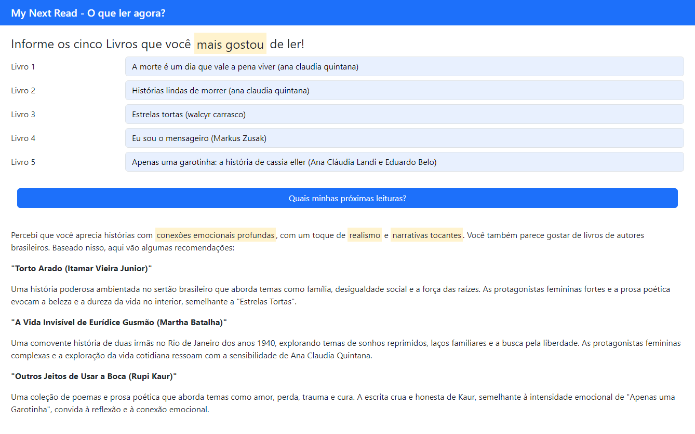
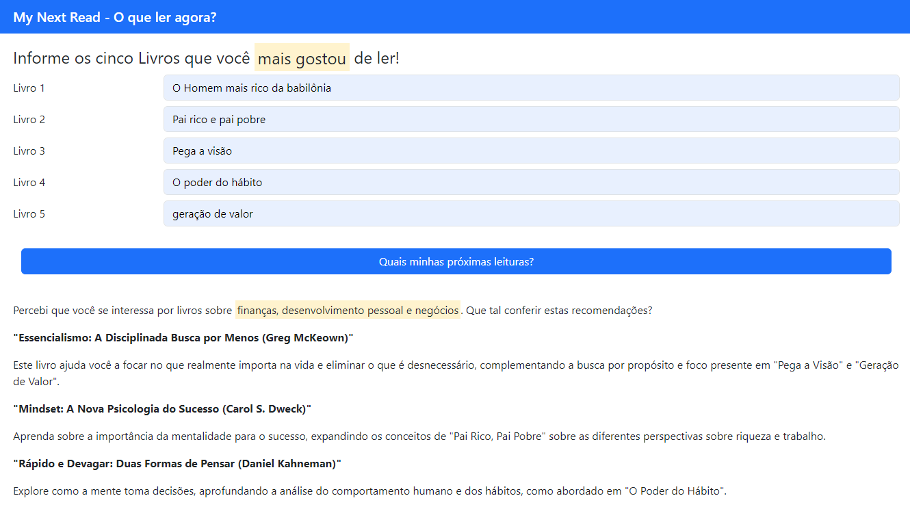

# My Next Read - O que ler agora?

Quem nunca terminou de ler um livro e ficou na dúvida do que ler em seguida não é mesmo?

Então utilize o My Next Read para saber o que você pode ler agora que tem a ver com seus gostos literários!

Teste a aplicação aqui [mynextread.mnunes.xyz](https://mynextread.mnunes.xyz/)

<p align="center"></p>

### Principais Tecniologias/Ferramentas

- Google GenerativeAI - Gemini API
- NodeJS
- Bootstrap
- HTML5


## Estratégias

Foi utilizada a estratégia de **Few-shot Chain-of-Thought Prompting** que consiste em uma combinação da técnica de Few Shot, em que se fornece exemplos de entrada e de saída no pormpt, como também a técnica de Cadeia de Pensamentos, ou seja, ensinar ao modelo como ele deve pensar para devolver uma resposta.

Induzi o modelo a identificar os gêneros literários mais presentes na lista e alguma outra caraterística como a quantidade de páginas. 

Além disso, no modelo de resposta, pedi que ele retornasse em *json*, para poder tratar na saída e poder facilmente manipular cada passo da resposta no *front*.

Coloquei uma tag *\<mark\>* para as categorias de livros indicadas na resposta esperada e ele também identificou esse detalhe.

<p align="center">
    
</p>

## Resultados



## Faça você mesmo

### Pré-requisitos

Apenas *git, nodejs e npm* instalado na máquina.

### Passo a passo

1. Clone o projeto na sua pasta de preferência
    ```
    cd /home/minha-pasta/

    git clone https://github.com/marcosnunesmbs/mynextread.git

   cd mynexread
    ```	
2. Instale as dependências
    ```	
    npm install
    ```

3. Renomeie o arquivo .env_example para .env e inclua a API_KEY
    ```	
    API_KEY="XPTO"
    ```		

    > Se não tiver uma API_KEY do Google AI Studio crie [clicando aqui](http://bit.ly/49NYCHv)
4. Inicie o servidor node
    ```
    npm run serve
    ```
5. Acesse o projeto no seu navegador
    ```	
    http://localhost